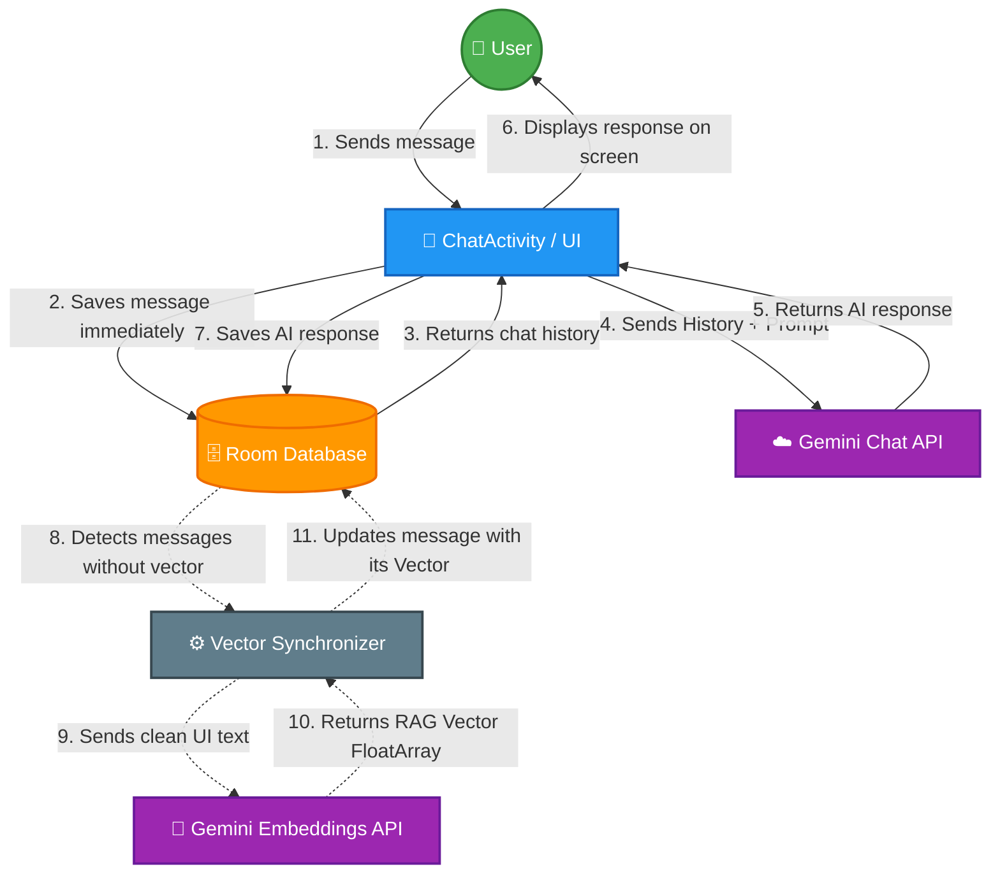

# Secure AI Chat Assistant (Android & RAG Implementation)

A practical implementation of Generative AI in mobile environments, focusing on long-term memory and secure data handling. This project was developed to explore the intersection of Android Development and Cybersecurity.

##  Technical Implementation

### Architecture & RAG Workflow

###  AI & Data Context
* **RAG Workflow:** Integrated a custom memory engine to provide the LLM with relevant historical context.
* **Vector Similarity:** Used **Cosine Similarity** logic to compare FloatArrays (Embeddings), ensuring the most relevant memories are retrieved.
* **API Integration:** Connected with Google’s `text-embedding-004` and `Gemini 1.5 Flash` using REST and SDKs, managing custom safety and generation settings.

###  Security & Performance (Cybersecurity Focus)
* **Native Layer (NDK/JNI):** Moved sensitive processing to C++ to practice basic obfuscation and protect app logic from easy reverse engineering.
* **Data Persistence:** Managed local storage with **Room Database**, using DAOs and Entities to handle complex message history.
* **Concurrency:** Used **Kotlin Coroutines** (Dispatchers.IO) to keep the UI responsive while performing background calculations.

###  Android Fundamentals
* **Modern Kotlin:** Built using Lambdas, Data Classes, and Extension Functions.
* **Dynamic UI:** Implemented a RecyclerView with multiple ViewTypes and used **ObjectAnimator** for smooth menu transitions.
* **Formatting:** Used `SpannableStringBuilder` for real-time text styling without relying on heavy HTML rendering.

###  MMD

---
*Note: Source code is private to protect API implementation details. Walkthroughs are available for technical interviews.*
