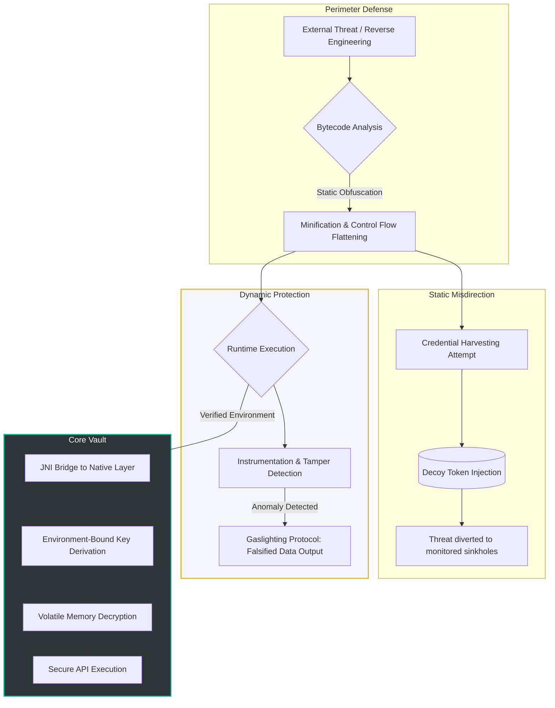

# Defense in Depth: Security Architecture

This repository implements a multi-layered security architecture designed to mitigate common mobile attack vectors, including static analysis, dynamic instrumentation, and binary tampering. 

The security model follows a strict "Defense in Depth" approach, ensuring that the compromise of a single layer does not result in the exposure of critical assets.

## 🛡️ Core Security Layers

### Static Obfuscation & Minimization
The application payload is protected using advanced bytecode obfuscation techniques.
- **Objective:** Prevent reverse engineering by flattening control flows and renaming critical business logic.
- **Implementation:** Strict minification rules are applied, preserving only the necessary serialization boundaries for local database integrity while obscuring the JNI bridge entry points.

### Static Misdirection (Decoy Systems)
To frustrate automated credential harvesting and static string analysis, the native layer incorporates decoy infrastructure.
- **Objective:** Increase the cost and time required for an attacker to identify valid cryptographic materials.
- **Implementation:** Multiple functionally null decoy tokens are statically distributed within the binary, acting as sinkholes for unauthorized access attempts.

### Dynamic Instrumentation Detection
The environment is continuously monitored during runtime to detect hostile analysis tools.
- **Objective:** Prevent dynamic debugging, memory dumping, and hooking frameworks.
- **Implementation:** Low-level heuristic checks monitor the process state. Upon detecting anomalies (e.g., attached debuggers), the application employs a "Gaslighting" protocol, silently feeding falsified data to the attacker's tools without crashing, thereby masking the detection mechanism.

### Native Cryptographic Vault
Critical decryption logic is isolated entirely within the native layer (C++) via the Android NDK.
- **Objective:** Protect the master decryption sequence from JVM-based inspection.
- **Implementation:** The master key is not hardcoded. Instead, it relies on an environment-bound key derivation sequence that validates the application's cryptographic signature at runtime. Decryption occurs exclusively in volatile memory, ensuring the plaintext secret is never written to disk.

### MMD

---
*Note: Specific implementation details, cryptographic seeds, and heuristic detection methods have been redacted from this public documentation to maintain operational security (OpSec).*
